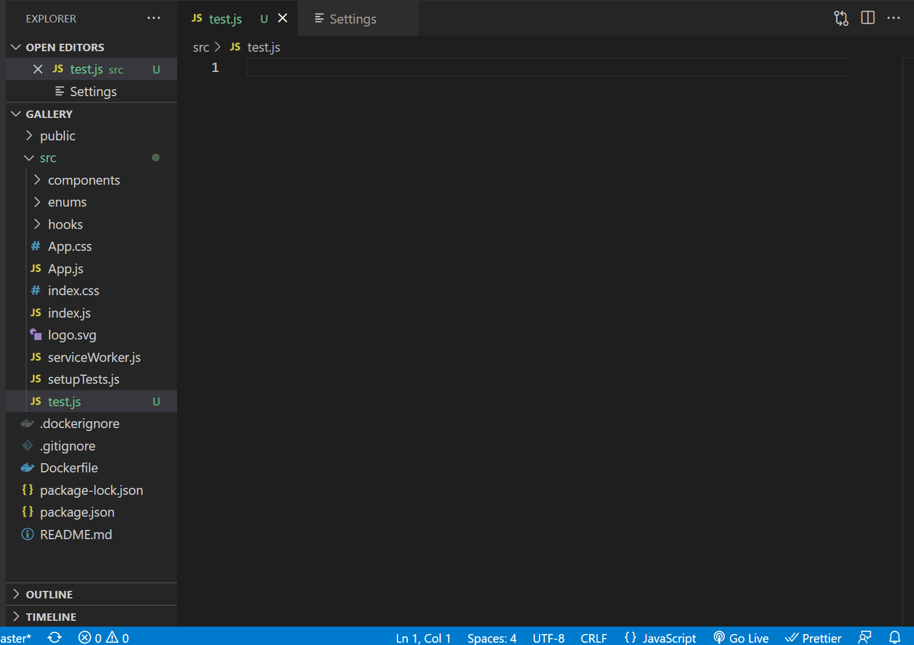

# Arrange Imports

This extension allows you to insert an import template at the beginning of your file based on your folders or the existing import statements. The goal of this extension is to make it easier for you to organize/arrange your imports.

## Features

- Compatible with Javascript, React, Typescript and other related languages/frameworks.

- Provides consistent and dynamic import template.

- To import template based on folder names, invoke the command either by pressing `ctrl+shift+a` on windows and `cmd+shift+a` on mac or by selecting _Add Imports_ through command palette.

- To import template based on current import statements, invoke the command either by pressing `ctrl+shift+i` on windows and `cmd+shift+i` on mac or by selecting _Detect Imports_ through command palette.

- Auto detect CSS, SASS (_.sass/.scss_) and LESS and adds a **STYLES** Comment

## Extension Settings

This extension contributes the following settings:

- **arrangeimports.addImports**: Search for _Imports/Add Imports_, in command palette, to run this extension.
- **arrangeimports.detectImports**: Search for _Imports/Detect Imports_, in command palette, to run this extension.
- **arrangeimports.folderDirectory**: Relative path of the folder (to root folder), containing your custom code. Set to `/src` by default, can be changed easily through settings.

## Release Notes

### 1.0.0

Initial release of **arrangeimports** extension.
.

### 1.1.0

Added command to detect imports

P.S. - It's my first extension so please feel free to suggest any features/changes :)

**Enjoy!**
